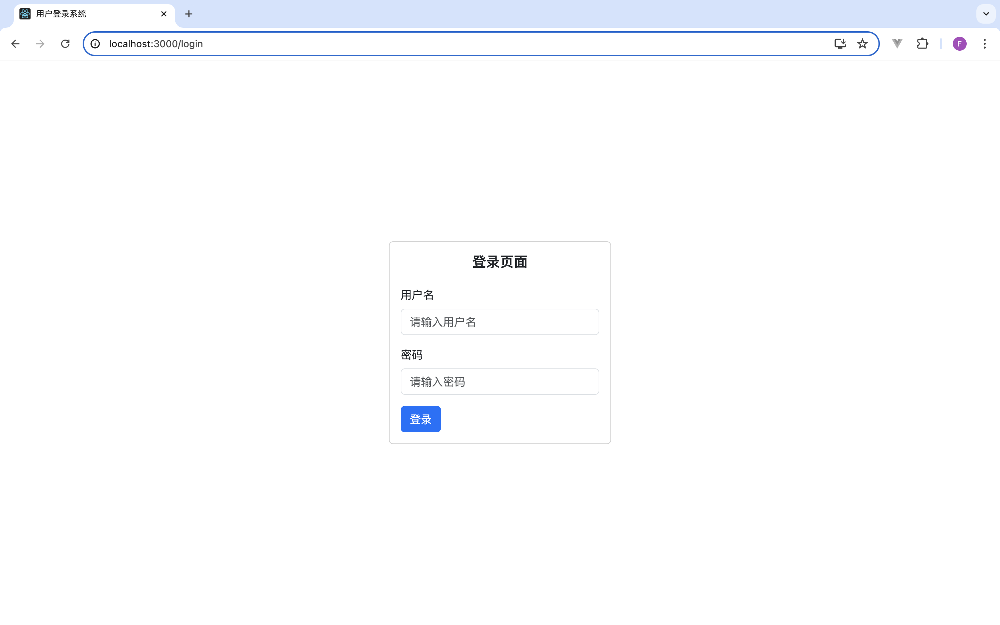
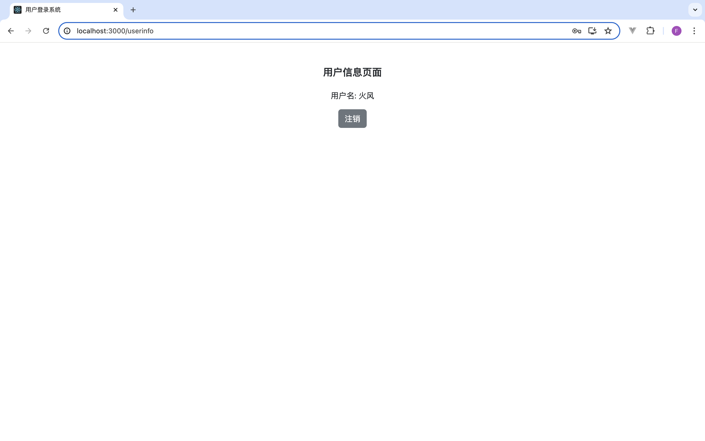

题目三：实现基于 JWT 的用户登录系统




使用方法：
1. `json-server --watch db.json --port 4000`
2. `npm start`

要求：
1. 使用 React、TypeScript 和 Redux 开发。
2. 实现一个简单的用户登录系统，包括以下功能：
    - 用户输入用户名和密码进行登录
    - 登录后获取 JWT 并保存到 Redux 全局状态中
    - 实现登录状态的页面跳转（例如，登录成功后跳转到用户信息页面）
    - 实现注销功能，清除 JWT 并返回登录页面
3. 使用 Redux 管理全局状态，定义 actions、reducers 和 store。
4. 使用 useSelector 和 useDispatch 钩子来访问和修改全局状态。
5. 界面应包括登录页面和用户信息页面：
    - 登录页面：包含用户名和密码输入框，以及登录按钮
    - 用户信息页面：显示登录的用户名和一个注销按钮
6. 使用 CSS 美化界面，使其简洁、美观。

附加要求：
1. 组件化设计：将登录表单、用户信息等拆分成独立的组件。
2. 使用 TypeScript 类型定义所有相关的 props 和 state。
3. 在实现 JWT 处理时，请使用以下示例代码：

示例代码：
```typescript
// 登录请求示例
const login = async (username: string, password: string) => {
  const response = await fetch('https://example.com/api/login', {
    method: 'POST',
    headers: {
      'Content-Type': 'application/json',
    },
    body: JSON.stringify({ username, password }),
  });

  if (!response.ok) {
    throw new Error('登录失败');
  }

  const data = await response.json();
  return data.token; // 假设返回的数据中包含 token
};
```

提示：
- 你可以使用 Redux Toolkit 简化 Redux 的配置。
- 尽量使用函数组件和 React Hooks。
- 使用 React Router 实现页面跳转。

提交内容：
1. 项目完整的源代码。
2. 详细的代码注释，解释你的思路和设计。
3. 截图或 GIF，展示应用的实际运行效果。